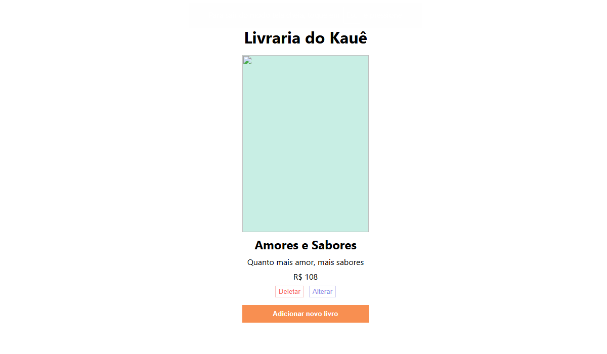

<h1 align="center">CRUD - Livraria</h1>

<p align="center">

</p>

### Tópicos

- [Descrição do projeto](#descrição-do-projeto)
  - [1. Create](#1-create)
  - [2. Read](#2-read)
  - [3. Update](#3-update)
  - [4. Delete](#4-delete)
- [Tecnologias](#tecnologias)
- [Projeto em funcionamento](#projeto-em-funcionamento)
- [Como utilizar o projeto](#como-utilizar-o-projeto)
- [Colaboradores](#colaboradores)

## Descrição do projeto

Nesse projeto de livraria, o **CRUD** é implementado para gerenciar o catálogo de livros, permitindo as seguintes operações:

### 1. Create
> Permite adicionar novos livros ao banco de dados. O usuário pode preencher informações, como **título**, **descrição**, **preço** e **capa**, para incluir um novo livro na biblioteca.

### 2. Read
> Exibe a lista de livros existentes. O usuário pode visualizar todos os livros armazenados, incluindo detalhes como **título**, **descrição**, **capa** e **preço**.

### 3. Update
> Oferece a possibilidade de editar informações de um livro específico. Isso permite corrigir ou atualizar dados, como o **título** ou a **descrição**.

### 4. Delete
> Remove livros do banco de dados. O usuário pode excluir registros de livros que não são mais necessários.

Essas operações juntas permitem que o sistema de livros funcione como uma interface completa de gerenciamento de dados, sendo o CRUD essencial para a interação e manutenção dos registros dos livros no projeto.

## Tecnologias

<div width="140px">
    
</div>

## Projeto em funcionamento

Clique na imagem abaixo para assistir ao tutorial em vídeo!

[](link-do-video)

**Descrição**: Este vídeo cobre todo o processo para visualizar o CRUD em funcionamento, do início ao fim.

## Como utilizar o projeto

```
< INSTALADORES >

npm i express mysql nodemon
npx create-react-app .
npm i react-router-dom
npm i axios
npm i cors


< INICIADORES >

>> Iniciar servidor
cd ./backend
npm start

>> Iniciar interface
cd ./client
npm start
```

## Colaboradores

| [<br><sub>Kauê Bertaze de Oliveira</sub>](https://github.com/KaueTTS)<br><sub>Developer Full Stack</sub> |
| :---:
